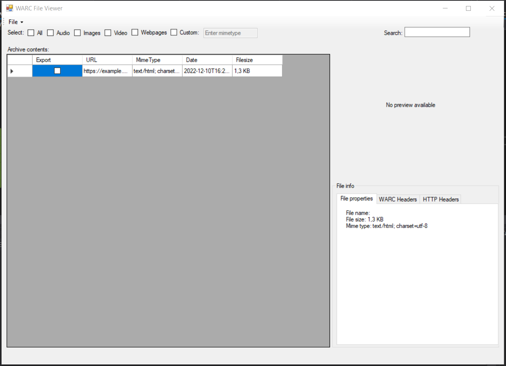

<h1 align="center">
  WARC File Viewer
   
</h1>

<h4 align="center">An easy to use c# app to browse and export contents of WARC Files</h4>

  <a href="#key-features">Key Features</a> •
  <a href="#how-to-use">How To Use</a> •

## Key Features

* Preview files - see image files directly within the archive
  - View all the image files in the WARC file without having to extract
  - Browse the content of a WARC file

* Bulk export - export multiple files at once
  - Export one, multiple or all the files at once

## How To Use
 - Download the latest release from the releases tab.

